 

 

Welcome to my GitHub repository! This repository is dedicated to sharing notes and resources related to blue team security, which focuses on detecting and preventing cyber attacks. Here, you'll find information on various aspects of blue team security, including email analysis, file analysis, log analysis, malware analysis, memory forensics analysis, and packet analysis.

<h3>Live Version of My Notes: <a href="https://hacking-notes.com" style="font-size: 18px;">https://hacking-notes.com</a></h3>

## Information

Below, you'll find a breakdown of the hacking methodology and various hacking techniques that is included in my notes:

- In the email analysis section, you'll find resources and techniques for analyzing email messages to detect phishing attempts, spam, and other malicious emails. The file analysis section covers techniques for analyzing files to identify potential threats, such as malware or suspicious activity.

- The log analysis section contains resources for analyzing system logs to identify potential security incidents, such as unauthorized access attempts or system misconfigurations. In the malware analysis section, you'll find resources for analyzing malware samples to identify their behavior, capabilities, and potential impact on systems.

- The memory forensics analysis section covers techniques for analyzing system memory to identify potential threats, such as malware that may be running in memory. Finally, in the packet analysis section, you'll find resources for analyzing network traffic to identify potential threats and security incidents.

- The system monitoring section equips you with tools for efficiently overseeing your system.

I hope this overview of the repository is helpful! Please feel free to explore the individual sections to learn more about each topic.

## Access My Additional Hacking Resources

Explore my Blue Team hacking notes, your go-to resource for defending against cyber threats with steadfast determination and state-of-the-art strategies. ---> <a href="https://github.com/Hacking-Notes/Redteam">RedTeam Notes</a>

Enhance your hacking toolkit with my Chrome Extension. Designed for ethical hacking and red team activities, it offers tailored features for an improved browsing experience. ---> <a href="https://github.com/Hacking-Notes/Extensions">Chrome Extension</a>

Elevate your bookmarking game with my latest Bookmark Toolkit. Engineered for ethical bookmarking and enhanced web exploration, it delivers customized features for a seamless browsing journey. ---> <a href="https://github.com/Hacking-Notes/Bookmarks">Bookmarks</a>

## Download my Notes

If you want to have my notes available offline in your Obsidian setup, feel free to download my archive file and customize it to your liking.

---

**Please note that these notes do not comprise a comprehensive guide to becoming a blueteamer. They are a work in progress and will continually be updated and expanded with more information.**

## 🧰 Hacking Notes Ecosystem

🌐 &nbsp;**[hacking-notes.com](https://hacking-notes.com)** &nbsp;·&nbsp; ✍️ &nbsp;**[blog](https://hacking-notes.medium.com/)** &nbsp;·&nbsp; 💬 &nbsp;**[discord](https://discord.gg/r68ameNHrD)**

| | Resource | What you get |
| :-: | -------- | ------------ |
| 🗺 | **[Hacker-Roadmap](https://github.com/Hacking-Notes/Hacker-Roadmap)** | Structured paths from beginner to pro — hobbyist, bug bounty, certs & degree. |
| 🔴 | **[RedTeam Notes](https://github.com/Hacking-Notes/RedTeam)** | Offensive security notes: recon, exploitation, Windows & Linux. |
| 🔷 | **[BlueTeam Notes](https://github.com/Hacking-Notes/BlueTeam)** | Defensive security notes: forensics, malware, log & packet analysis. |
| 🧩 | **[Extensions](https://github.com/Hacking-Notes/Extensions)** | Curated Chrome extensions for ethical hacking & recon. |
| 🔖 | **[Bookmarks](https://github.com/Hacking-Notes/Bookmarks)** | Curated hacker bookmark collection, one import away. |

<a href="#top">⬆ back to top</a>

